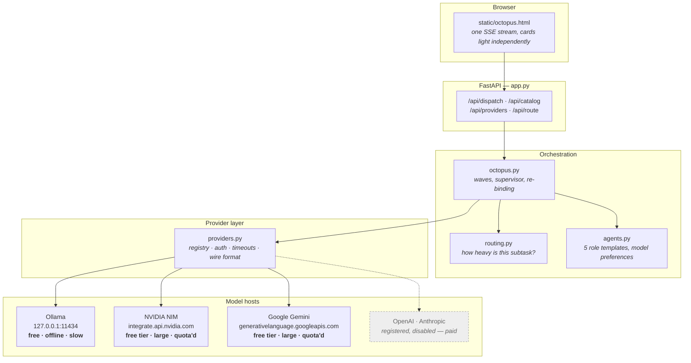
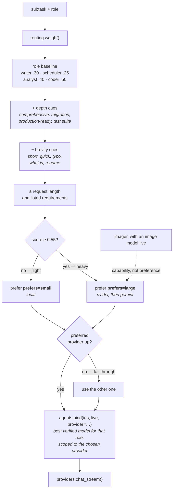
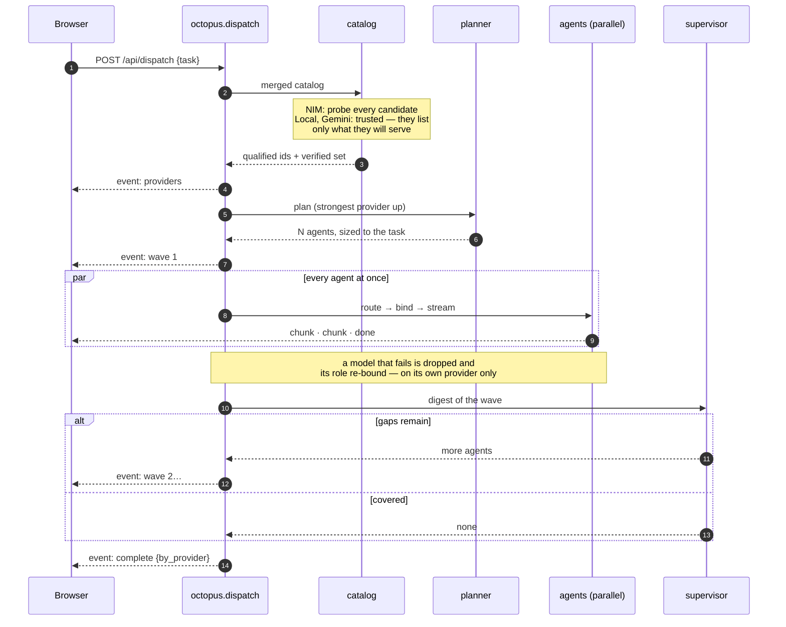
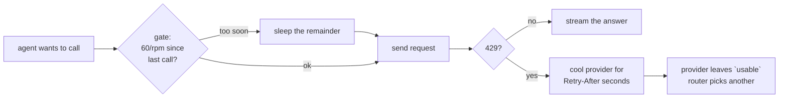

# Architecture

Octopus takes one task, decides how many agents it deserves, decides *where each of them
should run*, and streams all of them back over a single connection.

There are two ideas doing the real work. The first is that **a role is a template, not a
roster** — a role can be instantiated as many times as the task divides, so the pool grows
with the work. The second is that **a model is not a promise** — nothing is bound until it
has been proven to answer, and nothing is bound to one vendor.

---

## Module map

Each layer only knows about the one below it. That is what makes a new provider a
config change rather than a refactor.

`nim_client.py` still exists as a thin facade over `providers.py`, because the CLI
self-test and the original key console are written against its signatures.

---

## Where does this piece of work run?

This is the part that is new, and the part worth understanding. Every agent's subtask is
weighed **before** a model is bound to it. Scoring is deterministic keyword-and-length
work, not a model call — asking a model which model should answer would add a network
round trip to every agent, which on a one-line question costs more than just answering it.

Availability always wins over preference. Stop Ollama and every agent goes to a hosted
provider; remove every key and everything runs on this machine — neither case has a code
path of its own, they just fall out of `usable`.

Ordering inside each branch comes from the registry (`prefers`, then `priority`), not
from names written into the router, so a provider added later slots in rather than
landing at the back.

Two escapes from `auto`: `OCTOPUS_ROUTE=<provider>` pins a whole run, and
`POST /api/route` dry-runs the decision for a subtask so you can see the score before
changing the threshold.

---

## Dispatch lifecycle

The pool is sized by the task, then grown by a supervisor that reads what came back.

---

## Why models are proven, not trusted

`GET /v1/models` on NIM advertises far more than a key can run — on the key this was
built against, **102 models listed and 6 actually served completions**. Most return 404,
and several accept a request and then never reply, which surfaces as a read timeout
minutes later. So every NIM candidate is probed with a tiny completion first.

Local is the opposite case: Ollama lists only what is already on disk, so probing it
would add minutes to a catalog read to confirm something already known. A cold 7B takes
tens of seconds to load from disk before its first token. Those models are trusted on
sight (`trust_catalog=True`) and dropped the normal way if they ever actually fail.

A working catalog read is also not proof of a working key — NIM serves its model list to
anyone, so a bogus key gets a clean `200` and a hundred model names. Providers that take
a credential spend one extra one-token completion proving it, which is why a bad key
shows up as `bad key` at startup instead of as every agent failing `403` later.

| | local | nvidia | gemini |
|---|---|---|---|
| Key | none | `NVIDIA_API_KEY` | `GEMINI_API_KEY` |
| Catalog | trusted | probed model by model | trusted |
| Read timeout | 300 s (cold load) | 45 s (fail fast) | 60 s |
| Token cap | 700 | role default (1400–2000) | role default |
| Parallelism | 2 (shares this CPU) | 6 | 6 |
| `prefers` / `priority` | small / 0 | large / 10 | large / 20 |
| Rate gate | ungated | 36 req/min | 12 req/min |
| Gets | light work | heavy work, image generation, planning | heavy work, planning |

NIM is the only one whose catalog is probed. It is the anomaly, not the rule: Ollama
lists what is on disk and Gemini lists what it will serve, so probing either spends time
or free-tier quota confirming something already true.

---

## Spending as little as possible

Every provider in the table is free, so the budget being protected is quota and
wall-clock, not money. Four mechanisms, in order of how much they save:

| Mechanism | Saves |
|---|---|
| Planner skipped below weight 0.20 | one completion on every trivial dispatch |
| Light tasks capped at one wave | the supervisor's call plus the agents it would invent |
| Deliverable dedupe, one retry per slice | repeat work across waves |
| Per-provider token caps, optional dispatch ceiling | runaway generation |

The ledger then reports what was actually spent, per provider, in the `complete` event.
Token counts are estimates — agents stream, and streaming responses carry no usage block
— which is stated wherever they surface.

Routing breaks ties by *right size, then free before paid, then cheaper, then priority*.
Among today's providers the cost terms are a no-op, which is precisely why they are
encoded rather than assumed: enabling a paid provider later must add a fallback, not
silently capture every heavy agent.

## Respecting rate limits

Spacing rather than bursting is deliberate: a burst bucket lets a wave of eight agents
fire at once and then sit out the rest of the minute, which is exactly the shape that
trips a per-minute quota. Waiting a few hundred milliseconds costs less than the retry
that a `429` would have cost.

A `429` is never treated as a broken model. The model stays in the verified set and the
*provider* stands down, because the alternative — dropping the model — would both lose a
working model and send the retry to a different model on the same throttled provider.

---

## Adding a provider

1. Add a row to `PROVIDERS` in `providers.py` — name, base URL, key env var, timeouts,
   plus `prefers` and `priority` so the router knows where it sits.
2. If it speaks OpenAI's `/chat/completions`, that is the whole job. Gemini was exactly
   this: one row, because Google publishes an OpenAI-compatible surface. The only wrinkle
   was that it answers a bad key with `400` rather than `401`, and that it prefixes listed
   ids with `models/` — handled by `_is_auth_failure` and `id_prefix` respectively.
3. If it does not — Anthropic's `/messages` differs in request shape, streaming events
   and auth header — write the adapter at the `_require_openai_wire` seam.
4. Optionally add its model names to the tentacle `candidates` lists in `agents.py`, and
   a preference in `routing.py`.

Nothing in `octopus.py`, the tentacles, or the UI needs to change: model ids are
`provider:model` everywhere above the provider layer, and the router degrades to whatever
is in `usable`.

OpenAI and Anthropic are already registered and disabled. They are off because they are
paid and Octopus is deliberately free-resources-only — not because the shape does not
support them. Gemini is the proof: it went in as a registry row and a handful of model
names, with no change to the octopus, the tentacles, or the UI.
