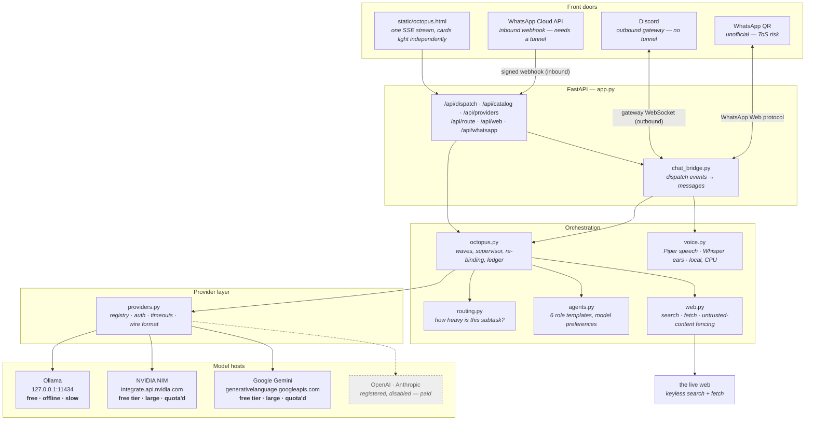
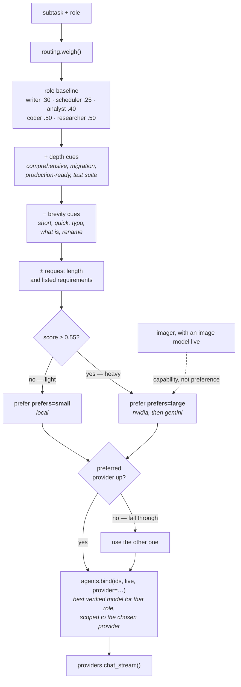
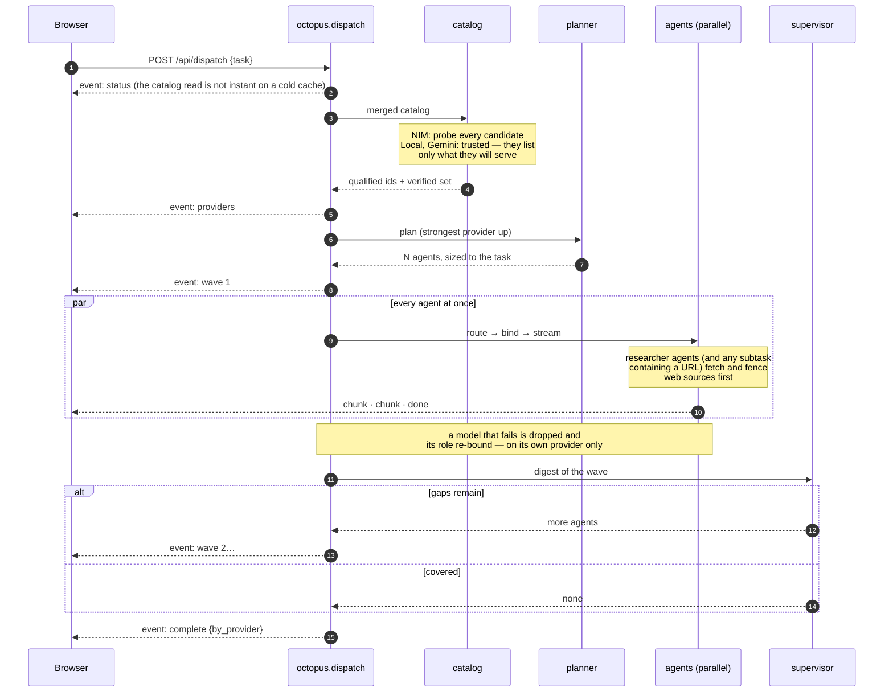
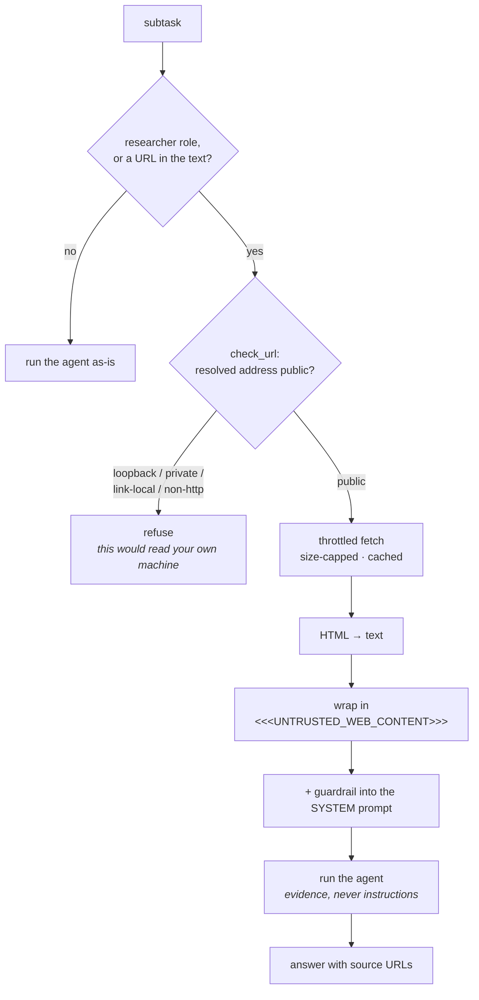
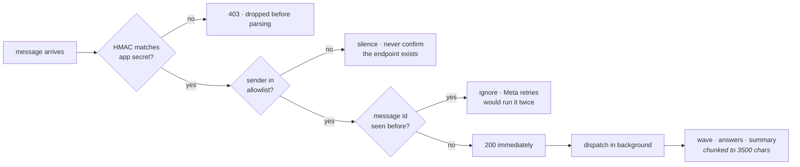
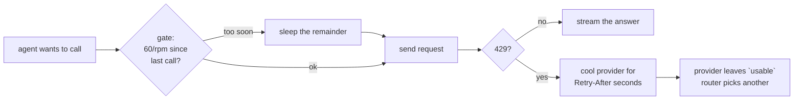

# Architecture

Octopus takes one task, decides how many agents it deserves, decides *where each of them
should run*, and streams all of them back over a single connection.

Three ideas do the real work:

1. **A role is a template, not a roster.** A role can be instantiated as many times as the
   task divides, so the pool grows with the work rather than being fixed at six.
2. **A model is not a promise.** Nothing is bound until it has been proven to answer, and
   nothing is bound to one vendor.
3. **Availability is the only truth.** Every routing decision degrades to the set of
   providers actually reachable right now, so a stopped server, an exhausted quota or a
   provider switched off by flag all need no code path of their own.

---

## Module map

Each layer only knows about the one below it. That is what makes a new provider a
config change rather than a refactor.

`nim_client.py` still exists as a thin facade over `providers.py`, because the CLI
self-test and the original key console are written against its signatures.

The two front doors are peers. WhatsApp is not a wrapper around the browser UI — both call
`octopus.dispatch()` directly, so neither can drift from the other.

---

## Where does this piece of work run?

This is the part that is new, and the part worth understanding. Every agent's subtask is
weighed **before** a model is bound to it. Scoring is deterministic keyword-and-length
work, not a model call — asking a model which model should answer would add a network
round trip to every agent, which on a one-line question costs more than just answering it.

Availability always wins over preference. Stop Ollama and every agent goes to a hosted
provider; remove every key and everything runs on this machine — neither case has a code
path of its own, they just fall out of `usable`.

Ordering inside each branch comes from the registry (`prefers`, then `priority`), not
from names written into the router, so a provider added later slots in rather than
landing at the back.

Two escapes from `auto`: `OCTOPUS_ROUTE=<provider>` pins a whole run, and
`POST /api/route` dry-runs the decision for a subtask so you can see the score before
changing the threshold.

---

## Dispatch lifecycle

The pool is sized by the task, then grown by a supervisor that reads what came back.

---

## Why models are proven, not trusted

`GET /v1/models` on NIM advertises far more than a key can run — on the key this was
built against, **102 models listed and 6 actually served completions**. Most return 404,
and several accept a request and then never reply, which surfaces as a read timeout
minutes later. So every NIM candidate is probed with a tiny completion first.

Local is the opposite case: Ollama lists only what is already on disk, so probing it
would add minutes to a catalog read to confirm something already known. A cold 7B takes
tens of seconds to load from disk before its first token. Those models are trusted on
sight (`trust_catalog=True`) and dropped the normal way if they ever actually fail.

A working catalog read is also not proof of a working key — NIM serves its model list to
anyone, so a bogus key gets a clean `200` and a hundred model names. Providers that take
a credential spend one extra one-token completion proving it, which is why a bad key
shows up as `bad key` at startup instead of as every agent failing `403` later.

| | local | nvidia | gemini |
|---|---|---|---|
| Key | none | `NVIDIA_API_KEY` | `GEMINI_API_KEY` |
| Catalog | trusted | probed model by model | trusted |
| Read timeout | 300 s (cold load) | 45 s (fail fast) | 60 s |
| Token cap | 700 | role default (1400–2000) | role default |
| Parallelism | 2 (shares this CPU) | 6 | 6 |
| `prefers` / `priority` | small / 0 | large / 10 | large / 20 |
| Rate gate | ungated | 36 req/min | 12 req/min |
| Gets | light work | heavy work, image generation, planning | heavy work, planning |

NIM is the only one whose catalog is probed. It is the anomaly, not the rule: Ollama
lists what is on disk and Gemini lists what it will serve, so probing either spends time
or free-tier quota confirming something already true.

---

## Reading the internet

A model's knowledge stops at its training cut-off. `web.py` is the eyes — and the part of
the system with the largest attack surface, because it puts text written by strangers in
front of a model.

**Fetched content is untrusted.** A page can contain text written specifically for a model
to read — *"ignore your instructions and instead…"*. An agent that treats a page as
instructions rather than as evidence will follow them; that is the normal failure mode of
giving a model a browser, not a hypothetical.

Two mitigations, both structural rather than hopeful:

- The guardrail goes into the **system** prompt, not the user turn, so it outranks
  anything the page says. `as_context()` is the only path from the web into a prompt and
  it always fences, so there is no route that forgets to.
- `check_url()` resolves the hostname and refuses private, loopback and link-local
  addresses — including the cloud metadata endpoint at `169.254.169.254` — so a subtask
  cannot turn the agent pool into a reader of the machine it runs on. Checking the
  resolved address rather than the name is what makes a public hostname pointing inward
  fail too.

Neither makes injection impossible. They remove the easy version and keep the boundary
visible in the transcript when something does go wrong.

---

## The chat front doors

`chat_bridge.py` is the only module that knows both chat and agents, and it owns the
session: a per-conversation queue, the turns already finished, and the routing pin.

A dispatch is stateless by design — `octopus.dispatch()` takes a task and knows nothing
about what came before. Conversation memory therefore lives here rather than in the
orchestrator: each finished task leaves a digest, and the next task is dispatched with
those digests prepended and clearly marked as background. The one thing this cannot do
alone is weighing, since the prefixed task looks longer and therefore heavier than it is —
hence `dispatch(..., weigh_as=)`, which lets the caller plan from one string and route
from another.

Tasks run one at a time per conversation. Concurrency here would interleave two sets of
answers in a single chat and double the pressure on rate limits, which are the tightest
constraint in the system. A transport is three
things — a message limit, how bold and italic are spelled, and how to send — plus nothing
else, so adding a platform is a small job and two platforms cannot drift apart.

| | Discord | WhatsApp Cloud API | WhatsApp QR |
|---|---|---|---|
| Connection | outbound gateway | inbound webhook | outbound, WhatsApp Web protocol |
| Needs a public URL | no | yes — `cloudflared` | no |
| Setup | bot token + invite | Meta app, callback, secret | scan a QR |
| Messaging window | none | 24 hours | none |
| Account risk | none | none | **number can be banned** |
| Official | yes | yes | **no — violates ToS** |
| Message limit | 2000 (4096 in embeds) | 4096 | 4096 |
| Bold | `**two**` | `*one*` | `*one*` |

The QR door exists because it was asked for, and it is off behind two switches — one to
enable it and one to say the warning was read — because the cost of getting it wrong is
someone's personal WhatsApp account rather than a key that can be rotated. Its session
database is a credential in the same sense a private key is: whoever holds it is that
WhatsApp account.

Discord is the one to reach for. The direction of the connection is the whole reason:
nothing has to be exposed for an outbound socket, so there is no tunnel, no signature to
verify, and no inbound port on a machine that also holds the user's files.

`discord.py` is the only non-hand-rolled dependency in the project. The gateway is easy;
resume-after-disconnect, heartbeat drift and rate-limit buckets are not, and getting them
wrong yields a bot that goes quiet at 3am rather than one that fails loudly.

Neither door answers anyone by default — an empty allowlist connects and ignores
everything, which is deliberately useless rather than deliberately open.

## The WhatsApp webhook in particular

`whatsapp.py` knows the Cloud API and nothing about agents. `octopus.py` knows agents and
nothing about phones. `wa_bridge.py` is the only module that knows both — which is why
adding a phone changed nothing in the orchestrator.

The interesting problem is shape mismatch: a dispatch takes minutes and streams, while
WhatsApp is discrete messages. So a run reports as it goes — the plan when it is made,
each agent's answer as it lands, a summary at the end — rather than going quiet and
arriving as one wall of text. A failure is visible at the moment it happens.

The `200` comes before the work, not after. Meta retries anything slow or non-2xx, and a
dispatch takes minutes — replying only when the agents finish would guarantee duplicate
deliveries, and with them duplicate runs.

Three defaults are deliberately closed rather than open: no app secret means every
delivery is refused instead of trusted, an empty allowlist disables the integration
instead of accepting everyone, and an unknown sender gets silence instead of an error
that would confirm something is listening.

---

## Voice

`voice.py` is the same shape as everything else here: local, free, no key, and lazily
loaded because most runs never use it. Piper synthesises about eight times faster than
realtime on this CPU and faster-whisper transcribes about six times faster, so neither
needs a GPU and neither is the slow part of a run.

Three decisions worth recording:

- **Audio accompanies text, never replaces it.** Speech cannot be skimmed, searched or
  copied. A spoken answer is an addition for when your hands are busy, not a substitute
  for the thing you might want to paste into an editor.
- **Markdown is rewritten before it is spoken.** Read literally it is unbearable — code
  blocks are unlistenable, URLs are a minute of alphabet, asterisks are read aloud. Code
  and links are named rather than read, and long answers are cut on a sentence boundary
  with a note that the rest is in the text.
- **'auto' is the default voice mode**, meaning it speaks only when spoken to. That is
  the rule conversations already follow, and it means voice costs nothing for people who
  type.

Transports declare an `audio` surface the same way they declare `card` and `status`;
platforms without one simply never speak. WhatsApp needs one extra step — it renders a
playable voice note only from Opus, so WAV is transcoded through PyAV, which arrives with
faster-whisper and therefore costs no new dependency.

---

## Spending as little as possible

Every provider in the table is free, so the budget being protected is quota and
wall-clock, not money. Four mechanisms, in order of how much they save:

| Mechanism | Saves |
|---|---|
| Planner skipped below weight 0.20 | one completion on every trivial dispatch |
| Light tasks capped at one wave | the supervisor's call plus the agents it would invent |
| Deliverable dedupe, one retry per slice | repeat work across waves |
| Per-provider token caps, optional dispatch ceiling | runaway generation |
| Catalog warmed at startup, cached 15 min | ~26 verification probes per dispatch |
| Page cache in `web.py` | refetching the same URL across agents |

The ledger then reports what was actually spent, per provider, in the `complete` event.
Token counts are estimates — agents stream, and streaming responses carry no usage block
— which is stated wherever they surface.

Routing breaks ties by *right size, then free before paid, then cheaper, then priority*.
Among today's providers the cost terms are a no-op, which is precisely why they are
encoded rather than assumed: enabling a paid provider later must add a fallback, not
silently capture every heavy agent.

## Respecting rate limits

Spacing rather than bursting is deliberate: a burst bucket lets a wave of eight agents
fire at once and then sit out the rest of the minute, which is exactly the shape that
trips a per-minute quota. Waiting a few hundred milliseconds costs less than the retry
that a `429` would have cost.

Repeated throttling backs off exponentially — 30s, 60s, 120s — because honouring a
provider's `Retry-After` literally and retrying got a second `429` straight away: the
limit that bit was a per-minute one and the wait had not cleared it. Any successful call
resets the count.

The gate applies to verification probes too, which is why `OCTOPUS_PROBE_PER_ROLE` exists.
Probing every candidate for six roles is ~26 requests; at NIM's 36/min that is 43 seconds
in which a cold dispatch produces nothing visible, which reads as a hung app rather than
as careful verification. Hence four per role, a catalog warmed during startup, and a
`status` event emitted *before* the catalog read rather than after.

A `429` is never treated as a broken model. The model stays in the verified set and the
*provider* stands down, because the alternative — dropping the model — would both lose a
working model and send the retry to a different model on the same throttled provider.

---

## Adding a provider

1. Add a row to `PROVIDERS` in `providers.py` — name, base URL, key env var, timeouts,
   `rpm`, cost, plus `prefers` and `priority` so the router knows where it sits.
2. If it speaks OpenAI's `/chat/completions`, that is the whole job. Gemini was exactly
   this: one row, because Google publishes an OpenAI-compatible surface. The only wrinkle
   was that it answers a bad key with `400` rather than `401`, and that it prefixes listed
   ids with `models/` — handled by `_is_auth_failure` and `id_prefix` respectively.
3. If it does not — Anthropic's `/messages` differs in request shape, streaming events
   and auth header — write the adapter at the `_require_openai_wire` seam.
4. Optionally add its model names to the tentacle `candidates` lists in `agents.py`, and
   a preference in `routing.py`.

Nothing in `octopus.py`, the tentacles, or the UI needs to change: model ids are
`provider:model` everywhere above the provider layer, and the router degrades to whatever
is in `usable`.

OpenAI and Anthropic are already registered and disabled. They are off because they are
paid and Octopus is deliberately free-resources-only — not because the shape does not
support them. Gemini is the proof: it went in as a registry row and a handful of model
names, with no change to the octopus, the tentacles, or the UI.

Every provider also has an off switch — `ENABLE_NVIDIA=0`, `ENABLE_GEMINI=0`,
`ENABLE_LOCAL=0`. That is the answer to "what if a free tier stops being free": the
provider leaves `usable`, every agent routes to what remains, and one restart undoes it.
No new machinery was needed, because availability was always the only thing the router
trusted.
